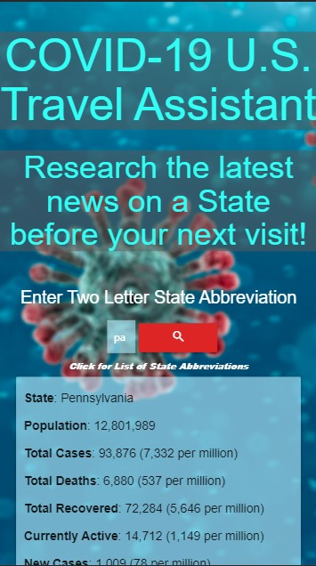

# Covid-19-contact-tracing-and-data-app

Website URL: https://millhouse36.github.io/Covid-19-contact-tracing-and-data-app/

# Mobile Screen Capture



# Screen Capture


## Application Requirements

* Must use at least two server-side APIs
* Must use a CSS framework _other than_ Bootstrap
* Must be interactive (i.e: accept and respond to user input)
* Use at least one new third-party API
* Must have a polished UI
* Must meet good quality coding standards
* Does not use alerts, confirms or prompts (look into _modals_)
* Must be deployed to GitHub Pages

## Presentation Requirements

* Elevator pitch: a one minute description of your application
* Concept: What is your user story? What was your motivation for development?
* Process: What were the technologies used? How were tasks and roles broken down and assigned? What  challenges did you encounter? What were your successes?
* Demo: Show your stuff!
* Directions for Future Development
* Links to the deployed application and the GitHub repository

## User Story

```
AS A responsible traveler 
I WANT an app with up-to-date infection and restriction data on my next travel destination
SO THAT I can see the current Covid opening status and infection rates of my destination.
```

## Acceptance Criteria

```
GIVEN I am a visitor on the "COVID-19 Travel Assistant"
WHEN I select a destination
THEN I am provided the most recent COVID-19 information and news on the destination selected with ability to book travel.
```